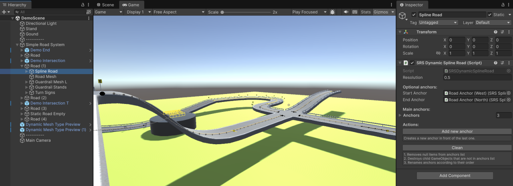

<h1 align="center">Simple Road System</h1>

A spline-based road creation library for Unity

## Features

- **Spline-based roads**: roads are defined by anchors with Bézier handles.
- **Road junctions**: spline-based roads can be connectend to junctions.
- **Props placement**: objects can be placed along the road with random interval and turn radius based filtering (e.g. sharp turn signs).
- **Road bumps**: library uses Perlin noise to add bumps to the generated meshes.

## Getting Started

1. Import the `Simple Road System` unitypackage or source code into your Unity project.
2. Go to the `Prefabs/` folder and drag the `Simple Road System` prefab into your scene.
3. Right click the `Simple Road System` game object in the `Hierarchy` and select `Prefab->Unpack Completely`.
4. Now you can modify the spline.
5. Select the `Simple Road System` game object in the `Hierarchy` and press the "Update All Roads" button in the `Inspector` to generate a road mesh.

To see more examples of using this tool, open a scene from the `Demo/DemoScenes/` folder.

## Components

Root component:

- `SimpleRoadSystem` - Controls bumps generation settings. Has a button in the `Inspector` that updates all child objects at once.

Spline-based components:

- `SRSDynamicSplineRoad` - Use this to configure the spline.
- `SRSDynamicMeshGenerator` - Generates a mesh by extruding the cross-section along the spline. Can be used for creating **roads** and **barriers**.
- `SRSDynamicObjectSpawner` - Spawns instances along a spline. If turn-dependent is on, spawns only on curves (based on turn radius). Suitable for adding **barrier stands**, **street lights** and **sharp turn signs**.

Non-spline components:

- `SRSStaticMeshGenerator` - Adds bumps to non-spline road parts. Use it on **road junctions**.

Terrain components (experimental):

- `SRSDynamicRoadTerrainUpdater`/`SRSStaticRoadTerrainUpdater` - Updates terrain heightmaps along a road part. Helpful for speeding up the terrain "sculpting" process. Requires manual corrections.